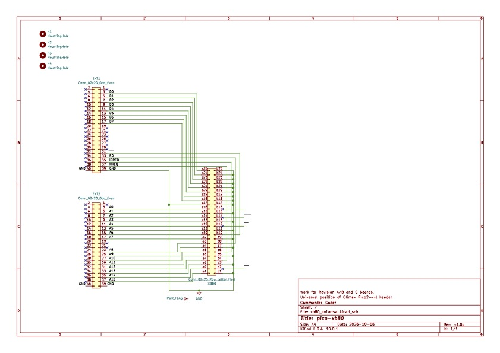
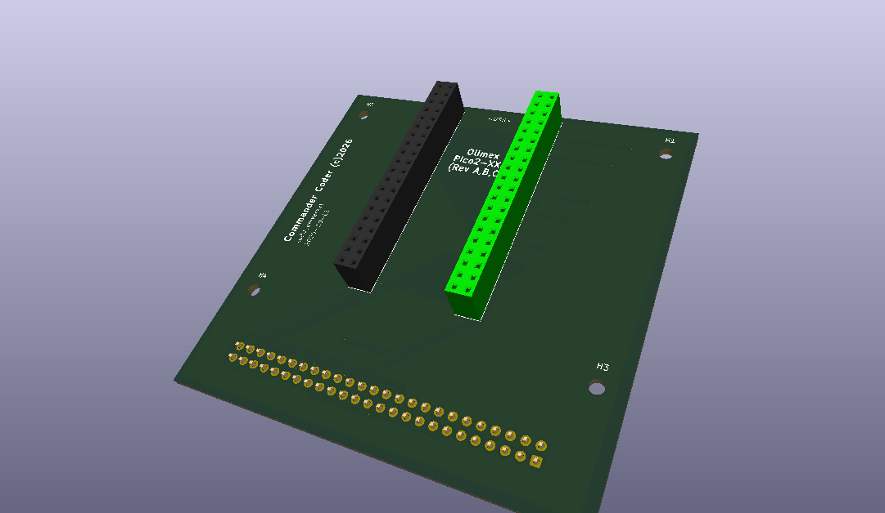

# Hardware

## Revision 1 schematic

The [`xb80_universal.pdf`](xb80_universal.pdf) file contains the first hardware revision schamatic design for the board.

## Revision 1 visual reference

Render of the assembled first-revision board layout and component placement for quick visual reference.

Pico on top with headers underneath.  Ribbon cable underneath that.