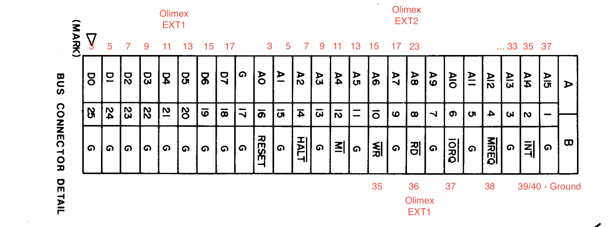

# pico-xb80

The pico-xb80 is an expansion bus (external bus, extended board) for late 1970's and early 1980's desktop computers.  Computers currently supported are:
* [Sharp MZ80K](https://en.wikipedia.org/wiki/Sharp_MZ)

And computers which could be supported with a little effort:
* [Tandy TRS-80 and clones](https://en.wikipedia.org/wiki/List_of_TRS-80_clones)

# Introduction

## The hardware

Off-the-shelf components are used for this project to keep it accessible to anyone.

* Pico 2350B and SD Card slot mounted on the [Olimex Pico2-XXL](https://www.olimex.com/Products/RaspberryPi/PICO/PICO2-XXL/open-source-hardware)
* Appropriate ribbon cable and jumper wires to connect the computer to the Olimex board.
  * Sharp MZ80K uses a [50-Way SCSI](https://www.google.com/search?q=50+way+ribbon+cable) 
  * [DuPont or similar](https://en.wikipedia.org/wiki/Jump_wire)

*In future* it is possible a single board with RP2350B with the SD card slot and 50 Way socket will become the wrap this into a single board.  For now, the Olimex is available for anyone wanting to experiment.

## The software:
* 1-bit SD Card interface software (initially from prompts to Claude.ai).  The Olimex Pico2-XXL has two variants.  One use 1-bit communication protocol and the other uses the 4-bit protocol.  My board used 1-bit so the software is built for this.
* `fatfs` module by ChaN
* Expansion Bus - provides a shared memory on the address bus.  [Pico PIOs](https://www.raspberrypi.com/news/what-is-pio/) rapidly reads addresses and data which several DMAs pump in and out of 64Kx16bit words (128Kb).
  * heavily influenced by [ATOM-DVI](https://github.com/cmoulang/Atom-DVI) after speaking with Chris about his project at an ABUG event. 
* pico-xb80_mz80k - the specific Sharp MZ80K interface.  
  * Z80 *ROM* this is shared on the bus at `0xF000` so that the Monitor ROM can jump to it with an `*FD` command.
  * Mailbox addresses so that the Z80 can send and receive commands and data to/from the Pico
  * Communcation with the SD card via the SD Card interface and `fatfs`

## Development Environment
* VSCode
* Raspberry Pi Pico extension ([SDK docs](https://pip-assets.raspberrypi.com/categories/610-raspberry-pi-pico/documents/RP-008276-DS-2-getting-started-with-pico.pdf))
* [git in VSCode](https://code.visualstudio.com/docs/sourcecontrol/overview) 
* Python 3

### Z80 Code
> **IMPORTANT:** You will need to compile your own version of `sjasmplus` for your platform.

* [sjasmplus](https://github.com/z00m128/sjasmplus) - assemble the Z80 code into a machine code binary
* bin2header.py - convert a binary file to a header file that can be included as part of the Pico executable

## Tools
Some Python tools were created using prompts to Claude.ai.

- `filehandle_path.py` - This tool will search any Sharp MZ80K file binary for calls to the tape handlers in the Monitor ROM and replace them with calls to the SD handlers in the ROM.

- `mz_tape_info.py` - This tool will scan any Sharp MZ80K files and determine their file type and whether they have already been patched.

# Build Instructions

## Wiring

Only the right column of pins are used from EXT1 and EXT2 on the Olimex board.  

  

| Olimex EXT1 | MZ80K | XB Signal |
|----------|----------|----------|
| P1 | nc | |
| P3 | A25 (mark) | D0 |
| P5 | A24 | D1 |
| P7 | A23 | D2 |
| P9 | A22 | D3 |
| P11 | A21 | D4 |
| P13 | A20  | D5 |
| P15 | A19 | D6 |
| P17 | A18 | D7 |
| P19 | nc | |
| P21 | nc | |
| P23 | nc | |
| P25 | nc | |
| P27 | nc | |
| P29 | nc | |
| P31 | B10 | NWR |
| P33 | B8 | NRD |
| P35 | B6 | NMREQ |
| P37 | B4 | NIOREQ |
| P39 | B3 | GND |

  

  

| Olimex EXT2 | MZ80K | Signal |
|----------|----------|----------|
| P1 | nc |  |
| P3 | A16  | A0 |
| P5 | A15  | A1 |
| P7 | A14  | A2 |
| P9 | A13 | A3 |
| P11 | A12  | A4 |
| P13 | A11  | A5 |
| P15 | A10  | A6 |
| P17 | A9  | A7 |
| P19 | nc |  |
| P21 | nc |  |
| P23 | A8  | A8 |
| P25 | A7  | A9 |
| P27 | A6  | A10 |
| P29 | A5  | A11 |
| P31 | A4  | A12 |
| P33 | A3 | A13 |
| P35 | A2 | A14 |
| P37 | A1 | A15 |
| P39 | nc |  |

  

## Uploading

Put the Olimex into Boot Mode.
* Hold down the BOOT button and connect the Olimex to your laptop via USB.  

Use Visual Studio Code to upload the code to the Pico.
* Select **Run Project (USB)** from the Project menu in the Pico extension.

## SD Card

Create a USB card with a folder in root named `MZ_FD`.  Inside this place the files you want to access.  Use the extension `.MZF` .  The file `0000.MZF` will be loaded whenever `*FD` is used from the Monitor.  

### Patching

Since the Monitor ROM is cannot be modified in software, a replacement ROM would be required to jump to file handling subroutines within the FD_rom.

In leui of this, it is simpler to patch programs which use tape file handling to jump to the FD_rom subroutines instead.

You can determine which files use file handling with `mz_tape_info.py`.  You can then patch those necessary with `filehandle_path.py` 

## Power

Either continue to use your Laptop USB power, or simply plug the Olimex into a USB power supply.

# Operating Instructions

See [here for instructions](OPERATING.md) for how to use pico-xb80 from the Sharp Monitor rom.

# Reference & Acknowledgements

Thank you to:

* https://github.com/yanataka60/MZ80K_SD
* https://github.com/cmoulang/Atom-DVI
* https://mz-80a.com/
* https://mz-archive.co.uk/
* https://www.sharpmz.net/
* https://claude.ai/ and all the other AIs (Gemini, Co-Pilot, ChatGPT) that tried to find answers for me.
